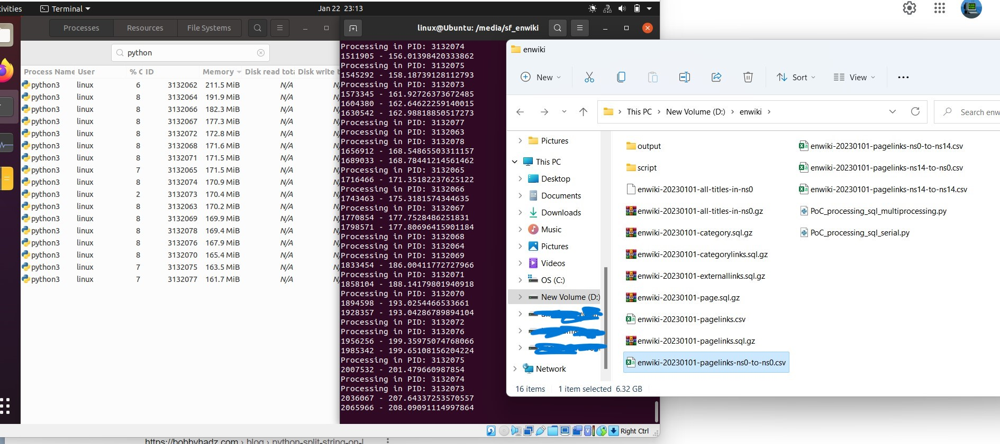
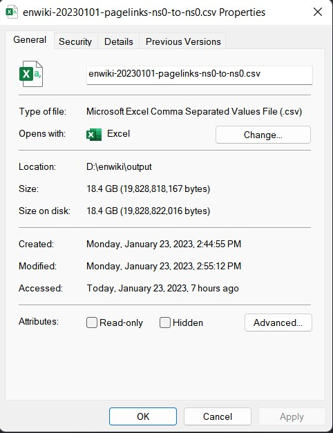

# Python (Optimized) vs Go using [mysqldump2csv](https://github.com/bramp/mysqldump2csv) 
**One process and probably one thread. Produce 102 GB (Unfiltered data). 12 Hours of processing in Go** \

**Multiprocessing in Python** \

**10 min only! produce 18 GB (Filtered data) in Python** \
